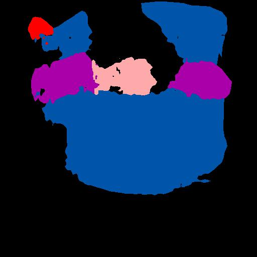

# pytorch-fcn
Fully Convolutional Networks[1] implemented in PyTorch. Some of the code are borrowed from [2], [3], [4]. Thanks them very much.

## Requirements
- python 3.6
- pytorch==0.3.0, torchvision, scipy, ...


**Note**:
- All the code are developed and tested on Python 3.6 and maybe not support Python 2.x

- You can install all the python packages one-line by running:
```shell
sudo pip3 install -r requirements.txt
```

## Data
Support Pascal VOC 2012 dataset. 
1. Download data by running:
```shell
wget http://host.robots.ox.ac.uk/pascal/VOC/voc2012/VOCtrainval_11-May-2012.tar
wget http://www.eecs.berkeley.edu/Research/Projects/CS/vision/grouping/semantic_contours/benchmark.tgz
```
2. Extract the *VOCtrainval_11-May-2012.tar* and *benchmark_RELEASE.tgz*, modify the data path in *config.py*.

## How to use
- To train the model:
```shell
python main.py --phase train
```
- To val the model:
```shell
python main.py --phase val
```
- To test
```shell
python main.py --phase test --in_path xxx/xxx.jpg --out_path ./results/
```

## Result



## Reference
[1] [Long J, Shelhamer E, Darrell T. Fully convolutional networks for semantic segmentation[C]//Proceedings of the IEEE Conference on Computer Vision and Pattern Recognition. 2015: 3431-3440.](https://people.eecs.berkeley.edu/~jonlong/long_shelhamer_fcn.pdf)

[2] [https://github.com/wkentaro/pytorch-fcn](https://github.com/wkentaro/pytorch-fcn)

[3] [https://github.com/meetshah1995/pytorch-semseg](https://github.com/meetshah1995/pytorch-semseg)

[4] [https://github.com/chenyuntc/pytorch-best-practice](https://github.com/chenyuntc/pytorch-best-practice)
